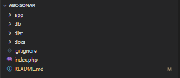
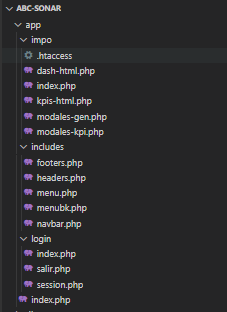
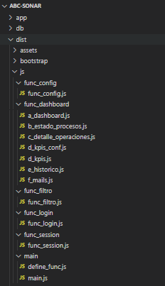
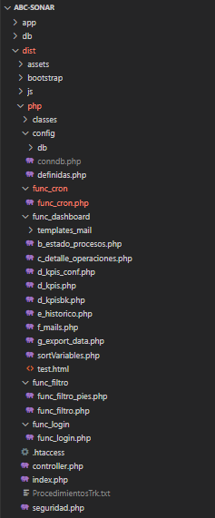

# Abc Sonar
Sistema de Gestion Sonar ABC repecev, para el control interno operaivo, visualización de KPIS con alcance a toda la operación Repecev en la linea de importaciones. Cuenta con funcionalidad de modificar datos. El aplicativo se alimenta por procesos automaticos controlados por medio de Cron Jobs y administrados por MySql y con Task Scheduler. La información que se utiliza como insumo a paritr de este proceso proviene de RPC Tracking

# Estructura

La estructura es semejante a los demás proyectos, donde se cuenta con un Stack de HTML con Bootstrap, JavaScript jQuery, y PHP. El aplicativo se encuentra hosteado en el servidor 10.35. Los procesos automáticos apuntan a la base de datos MsSql del servidor 1.16.

Los ficheros para cada caso son mencionados de manera general:

- HTML se encuentra en la ruta `\abc-sonar\app`. Se apoya con el bootstrap en la ruta `\abc-sonar\dist\bootstrap`.
- JS se encuentra en la ruta `\abc-sonar\dist\js`. Los plugins utilizados se encuentran en el siguiente directorio: `dist\plugins`
- PHP se encuentra en la ruta `\abc-sonar\dist\php`

## Front-end.

### HTML

Las vistas del aplicativo, se encuentran en la ruta `\abc-sonar\app`. 

En esta ruta encontrará 3 rutas principales:

- `\app\impo`: Incluye el front del contenido principal de la lógica de negocio.
- `\app\includes`: Partes del front correspondientes a los menus, encabezados, y pie de paginas, donde se incluyen los scripts de JS y las clases de CSS (bootstrap).
- `\app\login`: Vista de la pantalla de login de la plataforma.

Tenga en cuenta que las clases utilizadas en el front corresponde a clases principalmente de Bootstrap. por lo cual, en caso de requerir cambios o ajustes, puede consultar en la documentación del Bootstrap.

### JavaScript

La parte Javascript front end del proyecto se encuentra en la ruta `\abc-sonar\dist\js`.

Encontramos los siguientes directorios:

#### `\dist\js\func_config`

Contiene un unico archivo de Javascript `func_config`. Este repositorio contiene un código que utiliza la biblioteca Flatpickr para generar un calendario de fechas. El calendario es utilizado para seleccionar un rango de fechas y generar un informe en formato PDF.

Para ejecutar este código, necesitarás: La biblioteca Flatpickr, jQuery, sweetalert2.

#### `\dist\js\func_dashboard`
  
Este directorio tiene las principales funcionalidades front-end que comprende la logica del negocio. El nombrado de cada uno de los archivos se elabora para mantener conexión con sus pares en backend, es decir, por ejemplo el `a_modulo.js` y `b_modulo.js` tendrán sus pares correspondientes PHP `a_modulo.php` y `b_modulo.php`.

##### `a_dashboard.js`

Este es un fragmento de código en JavaScript que contiene dos funciones: "ActivaScripts()" y "Animaciones()". La función "ActivaScripts()" llama a cuatro funciones diferentes: "FechaTablero()", "Estado_Procesos()", "HistoricoChart()", y "KpisGenerales()". La función "Animaciones()" no recibe parámetros ni llama a ninguna otra función.

Es posible que estas funciones se utilicen en un proyecto o sitio web para activar determinados scripts y animaciones en la página. En particular, "FechaTablero()" podría utilizarse para mostrar la fecha actual en un tablero, "Estado_Procesos()" podría mostrar el estado actual de ciertos procesos, "HistoricoChart()" podría mostrar un gráfico histórico y "KpisGenerales()" podría mostrar métricas clave de rendimiento.

La función "Animaciones()" probablemente se utiliza para agregar efectos de animación a elementos en la página, aunque no hay suficiente información en el fragmento de código para estar seguro.

##### `b_estado_procesos.js`

El código contiene una función llamada Estado_Procesos que se encarga de obtener y mostrar información sobre el estado de los procesos en una interfaz gráfica. Para ello, hace uso de una petición AJAX al archivo controller.php y una vez que se reciben los datos, se muestran en una tabla y en un gráfico de pastel.

##### `c_detalle_operaciones.js`

Contiene las funciones Front útiles para la visualización detallada de las operaciones. Dado a que ofrece un mayor grado de detalle, hay mayor cantidad de funcionalidades. Algunas anotaciones relevantes son las siguientes:

- InputDocImpoNoDO: #InputDocImpoNoDO es un campo de entrada que está siendo observado. Cuando el usuario escribe en este campo, se desencadena una búsqueda en la tabla.
- HabilitarSelectDO(): La función HabilitarSelectDO() muestra un elemento con una alerta, y oculta otro. Esta función también maneja eventos de clic en algunos botones con la clase BtnSelectDO.
- PeticionDO(ID, DoSelected = 'NO'): La función PeticionDO(ID, DoSelected = 'NO') realiza una solicitud asíncrona para recuperar algunos datos del servidor. Esta función toma dos argumentos: ID, que es el ID del elemento que se está seleccionando, y DoSelected, que es un parámetro que indica si el elemento se ha seleccionado o no. Esta función también hace algunas operaciones en la página para mostrar los datos que se reciben del servidor.
- BtnActualizarDatos: #BtnActualizarDatos es un botón que permite al usuario actualizar los datos en la página. Cuando se hace clic en el botón, se recuperan los datos ingresados en los campos de entrada y se envían al servidor.

##### `d_kpis_conf.js`

Este código es parte de un proyecto que utiliza el lenguaje de programación JavaScript y la biblioteca jQuery. El objetivo del código es crear una interfaz de usuario para la gestión de indicadores clave de rendimiento (KPIs) en un sistema web.

El código se utiliza para manejar la lógica de eventos en la interfaz de usuario de la gestión de KPIs. Para ello, se definen diversas funciones que son llamadas cuando se producen eventos como hacer clic en un botón, cambiar una selección, etc.

El código hace uso de la biblioteca jQuery para acceder al DOM y manipularlo. Es necesario tener esta biblioteca importada en el proyecto antes de utilizar el código.

Para utilizar el código, se debe llamar a la función `$('.BtnKpi').on("click", function () {...})` cuando se hace clic en un botón con la clase BtnKpi. Esta función se encarga de realizar una serie de acciones, como asignar un valor a la variable idKPI, verificar si este valor es igual a "AgregarKpi" y llamar a la función OpenModalKpis().

La función OpenModalKpis() se encarga de realizar varias tareas, como llamar a las funciones SelectorClientes() y SelectorFechasKpis(), agregar y quitar clases a varios elementos del DOM y abrir un modal de Bootstrap. Además, verifica si la variable TypePost tiene un valor igual a "EditarKpi" y, en ese caso, llama a la función GetDataKpi().

Las funciones SelectorClientes(), GetDataKpi() y SelectorFechasKpis() son funciones auxiliares que realizan tareas específicas para la gestión de KPIs, como obtener datos de un servidor mediante una petición AJAX y actualizar elementos del DOM con estos datos.

La función `$('#SelectorClientes').on("change", function () {...})` se encarga de cambiar el contenido del DOM cuando cambia la selección de un elemento con el id SelectorClientes. Para ello, llama a la función `SelectorInstruccion()`.

La función SelectorInstruccion() es otra función auxiliar que obtiene datos de un servidor mediante una petición AJAX y actualiza un elemento del DOM con estos datos.

##### `d_kpis.js`

Este es un archivo JavaScript que contiene una función para generar indicadores clave de rendimiento (KPIs) generales. Esta función utiliza jQuery para realizar una solicitud AJAX y recibir los datos necesarios para generar los KPIs. Además, el archivo contiene algunas funciones adicionales para manejar eventos de clic y mostrar detalles específicos de los KPIs.

Para utilizar la función KpisGenerales(), se debe llamar a la función desde algún evento de clic en la página web. La función realiza una solicitud AJAX al servidor para obtener los datos necesarios para generar los KPIs y mostrarlos en la página web.

Las funciones adicionales, como OpenKPIDetails() y las que se encargan de manejar los eventos de clic en los botones, permiten interactuar con los KPIs generados y ver detalles específicos de los mismos.

##### `e_historico.js`

La función HistoricoChart() es una función en JavaScript que utiliza la biblioteca ECharts para representar gráficamente los datos de los procesos aduaneros.

La función HistoricoChart() hace una petición AJAX al archivo controller.php utilizando la función $.ajax() de jQuery. Los datos de la petición se almacenan en la variable DatosPeticion, que contiene el método "HistoricoChart".

Una vez que se recibe la respuesta de la petición AJAX, se muestran los datos en la página utilizando jQuery y se crea un gráfico con ECharts. La configuración del gráfico se almacena en la variable option.

La función Graficahistorico.setOption(option) se utiliza para mostrar el gráfico en la página.

##### `f_mails.js`
El código proporcionado contiene funciones que permiten realizar diferentes tareas relacionadas con el envío de notificaciones, la creación de mensajes, entre otros.
- La función `$('#BtnSelectAllDo')` permite seleccionar todos los elementos de una lista de tareas. La función HabilitarSelectDOMail() se encarga de obtener la información de una tarea y mostrarla en un mensaje, cuando se hace clic en un botón.
La función `$('#BtnCrearCorreo')` muestra un formulario modal para crear un nuevo mensaje y, posteriormente, inserta el último mensaje en el editor de texto CKEditor.
La función `$('#ClearTextArea')` limpia el editor de texto CKEditor.
La función `$('#BtnSendNotifysDO')` se encarga de enviar notificaciones por correo electrónico a diferentes usuarios, seleccionados previamente, con un asunto y un mensaje especificados.
La función `$('#BtnCrearCierre')` muestra un formulario modal para crear un nuevo cierre diario.
La función `$('#BtnGeneraCierreDiario')` se encarga de generar un cierre diario, con la información especificada en el formulario, y enviarlo por correo electrónico a los usuarios correspondientes.

- `\dist\js\func_filtro`

Incluy funcionalidades generales para la busqueda y generación de graficos, a partir de filtros que el usuario defina.

- `\dist\js\func_login`

Realiza las peticioneslal back para verificar la autenticación que se intenta realizar.

- `\dist\js\func_session`

Este código es un script en JavaScript que monitorea la actividad del usuario en una página web. Si el usuario no ha interactuado con la página web durante un período de tiempo especificado, se muestra una alerta indicando que su sesión ha caducado y se le redirige a la página de inicio de sesión.

- `\dist\js\main`

Funcionalidades de la ágina principal de la herramienta.

## Back-end.

### PHP

#### Controller.php
Este controlador de PHP es utilizado para realizar diversas tareas en una aplicación web. Al principio del archivo se inicia la sesión y se requieren varios archivos y clases necesarios para el funcionamiento del sistema, como "seguridad.php", "Excelinsert", "definidas.php", "conndb.php", "class_MySQL.php", "class_MsSQL.php", "festivos.php", "func_filtro.php", "func_filtro_pies.php", "b_estado_procesos.php", "d_kpis.php", "d_kpis_conf.php", "e_historico.php", "f_mails.php", "g_export_data.php", "func_login.php" y "func_cron.php".

A continuación, se establece una conexión con la base de datos MySQL y se comprueba si se han pasado argumentos en línea de comandos. Si es así, se procesan los argumentos y se ejecuta la tarea correspondiente. Las tareas disponibles son: "CopyDataDeTracking", "CronValidarKPI", "CopyDataDeTrackingSinHora", "CopyHistorico", "CalcularDatosAdicionales", "InsertarHistorico" y "CalcularDatos". Cada una de ellas realiza una tarea específica en el sistema.

Si no se han pasado argumentos en línea de comandos, se comprueba si el usuario ha iniciado sesión en la aplicación web. Si no ha iniciado sesión, se comprueba si se ha enviado algún formulario de inicio de sesión. Si se ha enviado el formulario, se procesa la solicitud y se inicia la sesión del usuario. Si el usuario ya ha iniciado sesión, se comprueba si se ha enviado algún otro formulario y se procesa la solicitud correspondiente.

En resumen, este controlador de PHP es esencial para el correcto funcionamiento de la aplicación web y se encarga de procesar las tareas y solicitudes enviadas por el usuario, así como de mantener la sesión del usuario en la aplicación.

#### dist\php\func_cron

La función "CopyDataDeTracking" actualiza una tabla en MySQL llamada "abc_cron_control.tbl_cron" con un array que contiene un ID de proceso, un estado y un tiempo. Luego, vacía una tabla llamada "imseguimientooperativo" en la misma base de datos y procede a copiar datos de otra tabla en una base de datos MSSQL, "BotAbc.dbo.IMSeguimientoOperativo". Esta función recorre los datos de la tabla MSSQL, los procesa y los inserta en la tabla "imseguimientooperativo" de la base de datos MySQL. Además, realiza una serie de acciones adicionales, como calcular datos, validar y actualizar información en la base de datos.

Por otro lado, la función "CopyHistorico" también copia datos de una tabla de una base de datos MSSQL a una tabla llamada "imseguimientooperativo_historico" en la base de datos MySQL. Esta función recorre los datos de la tabla MSSQL, los inserta en la tabla "imseguimientooperativo_historico" de la base de datos MySQL y muestra información de progreso en la consola.

Ambas funciones utilizan métodos y objetos de conexión a las bases de datos, así como la clase "FunctionsMySQL", que contiene funciones genéricas para realizar consultas y operaciones en la base de datos MySQL.

#### dist\php\func_dashboard

En este direcotrio encuentra los contrapartes en PHP de los JS del directorio `\dist\js\func_dashboard`. Las funciones descritas en ese Script apuntan al controlador, y este a su vez, a los PHP que se encuentran aquí.
Para mpas detalle de en qué consiste cada modulo, puede consultar en la parte del JS.

#### dist\php\func_filtro
#### dist\php\func_login